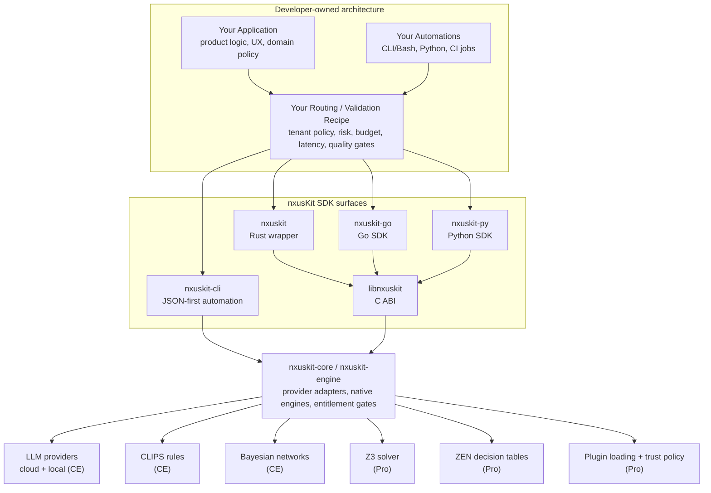
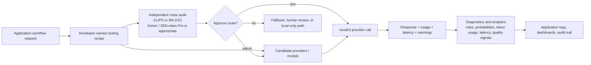
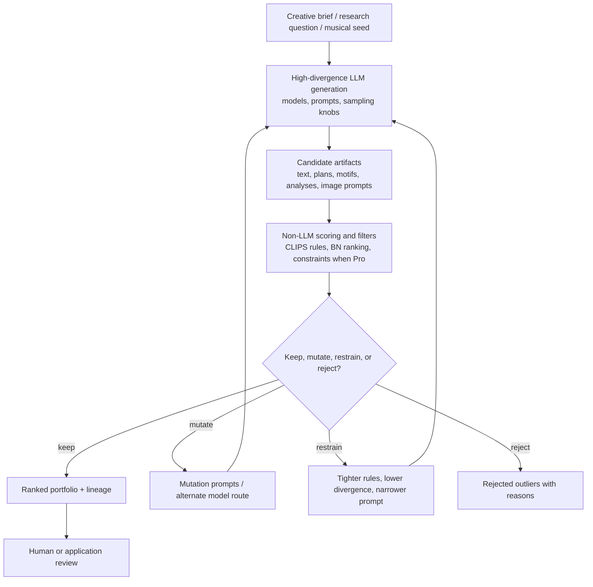
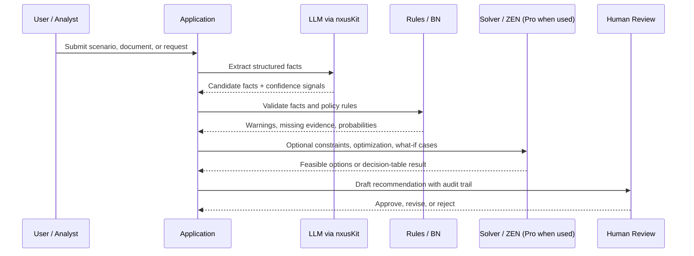
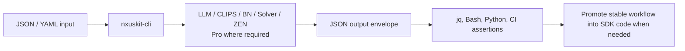

# nxusKit Architecture

## Overview

nxusKit is a polyglot intelligence SDK for applications and automations that need LLM providers, CLIPS rule engines, and Bayesian networks in Community Edition, plus Pro Z3-backed solvers, ZEN decision tables, plugin loading, trust-policy features, and JSON-first CLI workflows behind one integration surface.

The architecture has two audiences:

- nxusKit maintainers, who need clear package boundaries and release mechanics.
- Application developers, who need practical patterns for routing, auditing, validating, and analyzing AI-assisted workflows inside their own systems.



The application owns business policy, data handling, workflow recipes, prompts, validation requirements, audit retention, and user experience. nxusKit supplies stable SDK surfaces and engine integrations that let those policies be implemented without binding the application to one provider or one reasoning paradigm.

## Package Map

```
nxusKit/
├── packages/
│   ├── nxuskit/              # User-facing Rust wrapper over libnxuskit
│   ├── nxuskit-engine/       # Internal Rust engine workspace
│   │   └── crates/
│   │       ├── nxuskit-core/ # C ABI and native SDK boundary
│   │       ├── nxuskit-engine/
│   │       ├── nxuskit-cli/
│   │       └── clips-sys/
│   ├── nxuskit-go/           # Go SDK, package name nxuskit
│   └── nxuskit-py/           # Python SDK, module name nxuskit
├── conformance/              # Cross-language test vectors and schema
├── sdk-packaging/            # Release bundle docs, manifests, and packaging
├── docs/                     # Supporting documentation
└── tests/                    # Acceptance, parity, and integration fixtures
```

Related public repositories:

- `nxusKit` - public Community Edition source, docs, and publishable tests.
- `nxusKit-examples` - runnable examples labeled by edition.

Private repositories and internal folders may contain commercial implementation details, release planning, or non-public validation data. Public documentation should describe shipped behavior and edition boundaries without exposing those internals.

## Edition Boundaries

nxusKit SDK uses a dual-edition model:

- Community Edition is free and open source. It includes LLM providers, local providers, streaming, tool calling, structured output, vision, retry/fallback, CLIPS basics, Bayesian inference, and CE-safe hybrid reasoning patterns such as LLM plus CLIPS validation.
- Pro adds proprietary commercial capabilities for teams that need solver-backed workflows, ZEN decision tables, plugin loading, and trust-policy features.
- Released CE features are not moved behind the Pro paywall. Code released as CE remains available under its open-source license.
- Pro requirements should be labeled at the first useful mention. A developer should not have to run a workflow to discover that it requires Pro.

## Integration Surfaces

| Surface | Primary Use | Notes |
|---------|-------------|-------|
| `nxuskit` Rust wrapper | Rust applications using the release SDK | Safe wrapper over `libnxuskit`; do not direct public examples to `nxuskit-engine`. |
| `nxuskit-go` | Go applications | Idiomatic Go API plus FFI-backed access where native engines are needed. |
| `nxuskit-py` | Python applications, notebooks, and automation | Synchronous provider API plus FFI-backed native engine access. |
| `libnxuskit` C ABI | Native integrations and language wrappers | Opaque handles, JSON payload boundaries, shared release ABI. |
| `nxuskit-cli` | CLI/Bash, CI, and JSON-first prototypes | Useful before app code exists and for automation that should not link SDK code. |

Use `nxuskit-cli` when a workflow is easiest to express as JSON-in/JSON-out automation. Use a language SDK when the workflow belongs inside long-running application code, needs local type models, or must integrate tightly with application state.

## Pattern 1: LLM Provider Routing Recipes

Applications rarely route LLM calls on cost alone. A routing recipe can encode tenant policy, model capability requirements, data sensitivity, region constraints, latency budgets, failure posture, provider health, token budget, expected output schema, user tier, and task criticality.

nxusKit makes the provider call portable; the application still owns the recipe.



Practical examples:

- A support product can route routine summarization to a low-latency model, route sensitive cases to a local provider, and require CLIPS validation before the response is shown.
- A research workflow can route extraction to one model, synthesis to another, and use Bayesian scoring to estimate confidence before passing the result to a reviewer.
- A regulated workflow can keep the LLM route decision separate from the LLM itself. The application can ask nxusKit-supported non-LLM engines to approve, reject, or annotate the route before any provider call is made.

CE implementation building blocks include multi-provider routing, capability detection, retry/fallback, local providers, CLIPS rules, and Bayesian inference. Pro can add solver-backed route feasibility, ZEN decision tables, and trust-policy/plugin controls where those features are required.

## Pattern 2: Creativity Engine

A creativity engine intentionally explores a wider possibility space than a normal deterministic workflow. It can vary prompts, model choices, temperature-like provider knobs where supported, sampling options, seed material, and mutation prompts to generate many candidates. The goal is not to control imagination perfectly; it is to manage how far the system is allowed to wander, preserve traceability, and make pruning or promotion explicit.



This can be built with nxusKit today by combining provider-agnostic LLM calls, multi-provider routing, structured outputs, CLIPS rules, Bayesian scoring, and application-owned iteration state. Pro features can add solver constraints or ZEN decision tables for domains where candidate selection must satisfy formal rules.

Use cases include music motif exploration, visual-art prompt iteration, research hypothesis generation, product naming, narrative design, and design-space exploration. The genetic-algorithm analogy comes from candidate generation, scoring, selection, mutation, and lineage tracking. nxusKit provides the engines and common interfaces; the application implements the population strategy, domain fitness functions, and final review policy.

## Pattern 3: Policy-Gated Decision Support

Decision-support workflows often need more than a fluent answer. They need extraction, normalization, route validation, deterministic checks, what-if exploration, and reviewable evidence.



CE can support extraction, structured output, CLIPS validation, Bayesian inference, provider fallback, and local-provider routing. Pro is required when the workflow uses Z3-backed solving, solver what-if analysis, ZEN decision tables, plugin loading, or trust-policy features.

Examples from the nxusKit portfolio that map to this pattern include `clips-llm-hybrid` (CE), `bayesian-inference` (CE), `llm-solver-hybrid` (Pro), `solver-what-if` (Pro), and `zen-decisions` (Pro).

## Pattern 4: CLI-First Automation

Some integrations should start as scripts rather than application code. `nxuskit-cli` is the fastest path for CI checks, release smoke tests, shell workflows, and prototypes where JSON files are easier to review than code changes.



CLI-first work is especially useful for provider status checks, local-provider smoke tests, prompt and schema iteration, examples, CI gates, and reproducible bug reports. Once the recipe is stable, the same workflow can move into Rust, Go, Python, or C ABI code.

## Cross-Language Parity

nxusKit keeps public concepts consistent across languages:

| Concept | Rust | Go | Python |
|---------|------|----|--------|
| Chat request | `ChatRequest` | `ChatRequest` | `ChatRequest` / message dicts |
| Chat response | `ChatResponse` | `ChatResponse` | `ChatResponse` / response dicts |
| Message | `Message` | `Message` | `Message` |
| Provider | `AsyncProvider` / `NxuskitProvider` | `Provider` interface | `Provider` factory |
| Mock provider | `MockProvider` | `MockProvider` / test helpers | test utilities |
| Native SDK boundary | `libnxuskit` | FFI where needed | CFFI where needed |

Cross-language parity is enforced with shared fixtures and conformance vectors where they can be published safely. See [TESTING.md](TESTING.md) for the public test-release policy.

## Public Repository Topology

nxusKit uses a source-of-truth workflow with selective publishing:

1. Private source repository: full codebase, internal specs, release planning, and non-public validation.
2. Public `nxusKit` repository: open-source Community Edition source, public docs, release packaging metadata, and publishable tests.
3. Public `nxusKit-examples` repository: runnable examples in Rust, Go, Python, and CLI/Bash, labeled by edition.
4. Private add-on repositories: commercial and internal-only implementation details.

Public exports should include the artifacts developers need to build against CE and understand Pro boundaries. They should not expose proprietary Pro internals, private test data, credentials, or internal roadmap content.

## Decision Matrix

| I want to... | Use |
|--------------|-----|
| Build a Rust application against the SDK bundle | `packages/nxuskit/` |
| Build a Go application with LLM providers or native-engine access | `packages/nxuskit-go/` |
| Build a Python application, notebook, or local automation | `packages/nxuskit-py/` |
| Integrate from C or another native runtime | SDK bundle `include/nxuskit.h` and `libnxuskit` |
| Prototype or automate a JSON-first workflow | `nxuskit-cli` |
| Route LLM calls dynamically | Application-owned recipe plus nxusKit providers, capability detection, and fallback |
| Validate LLM output deterministically | CLIPS rules in CE; solver/ZEN when Pro features are required |
| Publish tests publicly | Follow [TESTING.md](TESTING.md) and release only reviewed fixtures |

## Next Steps

- [README.md](README.md) - top-level SDK overview
- [GETTING_STARTED.md](GETTING_STARTED.md) - quick-start guide
- [TESTING.md](TESTING.md) - public test-release philosophy
- [sdk-packaging/docs/tier-comparison.md](sdk-packaging/docs/tier-comparison.md) - Community Edition and Pro feature map
- [packages/nxuskit/README.md](packages/nxuskit/README.md) - Rust wrapper
- [packages/nxuskit-go/README.md](packages/nxuskit-go/README.md) - Go SDK
- [packages/nxuskit-py/README.md](packages/nxuskit-py/README.md) - Python SDK
