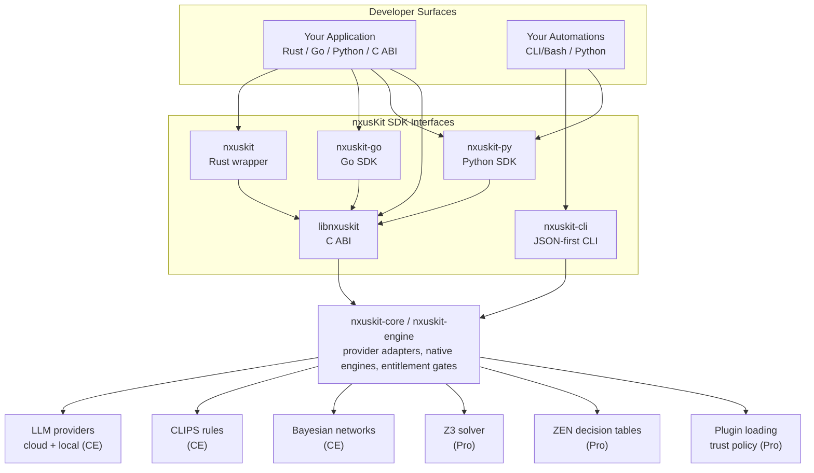

# nxusKit

**One SDK. Every reasoning engine. Three languages.**

Polyglot SDK for 16+ LLM providers, CLIPS rule engines, and Bayesian networks in Community Edition, plus Pro solver, ZEN decision-table, plugin-loading, and trust-policy capabilities — Rust, Go, and Python SDKs plus `nxuskit-cli` for shell automation and CI.

[](https://github.com/nxus-SYSTEMS/nxusKit/actions)
[](LICENSE-MIT)


**[Documentation](https://docs.nxus.systems/nxuskit/)** · **[Getting Started](https://docs.nxus.systems/nxuskit/getting-started/installation/)** · **[Examples Docs](https://docs.nxus.systems/nxuskit/examples/)** · **[Examples Repo](https://github.com/nxus-SYSTEMS/nxusKit-examples)** · **[Website](https://nxus.systems)**

> **General Availability**: nxusKit SDK v1.0.4 is the current GA patch release of the stabilized v1.0 API surface. It preserves the v1.0.0 API and C ABI contracts while hardening release provenance, bundled Python setup guidance, and public trust wording. The v1.0.1 Pro SDK CLI packaging fix remains included.

---

## Get Started

Choose your language:

| Language | Package | Install |
|----------|---------|---------|
| **Rust** | [nxuskit](packages/nxuskit/) | Path dependency from SDK bundle |
| **Go** | [nxuskit-go](packages/nxuskit-go/) | `go get github.com/nxus-SYSTEMS/nxusKit/packages/nxuskit-go` |
| **Python** | [nxuskit-py](packages/nxuskit-py/) | `python -m pip install nxuskit-py==1.0.4`; SDK bundle `python/src` for native/FFI engines |
| **C ABI** | [Pre-built binaries](https://docs.nxus.systems/nxuskit/getting-started/installation/) | Download from [Releases](https://github.com/nxus-SYSTEMS/nxusKit/releases) |

### Build Community Edition From Source

The public repository is intended to be buildable as Community Edition source
without internal nxusKit infrastructure:

```bash
git clone https://github.com/nxus-SYSTEMS/nxusKit.git
cd nxusKit
make build
make qa
```

`make build` compiles the CE native library, checks the Rust wrapper, builds the
Go SDK, and byte-compiles the Python package. `make qa` adds the source-build
QA checks that are safe for a fresh public checkout.

### CLI / Shell Automation

nxusKit includes `nxuskit-cli`, a JSON-first control plane for shell automation, CI, and multi-engine reasoning workflows. The CLI provides machine-facing access to all nxusKit engines — no library code required.

```bash
# LLM invocation with structured output
echo '{"prompt":"hello","provider":"claude","model":"claude-sonnet-4-20250514"}' \
  | nxuskit-cli call --input - --format json

# Constraint solving (Pro; implementation not shipped in public CE)
nxuskit-cli solver solve --input problem.json --format json

# What-if analysis with base vs. assumed comparison (Pro)
nxuskit-cli solver what-if --input base.json --compare assumed.json --format json

# ZEN decision-table utilities (Pro): structural validation + fixture testing
nxuskit-cli zen validate --input my_table.jdm.json --format json
nxuskit-cli zen test --input fixtures.json --format json

# Bayesian network parameter learning + evidence validation
nxuskit-cli bn learn --input bn_learn.json --format json     # learn CPDs from CSV; output is BIF-exportable
nxuskit-cli bn evidence --input observations.json --format json

# List available providers
nxuskit-cli provider list --format json

# CLIPS session management
nxuskit-cli clips session create --input rules.json --format json
nxuskit-cli clips session list --format json

# Multi-engine pipeline
nxuskit-cli pipeline run --input workflow.yaml --format json

# Shell completions (bash / zsh / fish)
nxuskit-cli completions bash >> ~/.bashrc
nxuskit-cli completions zsh > ~/.zfunc/_nxuskit-cli
nxuskit-cli completions fish > ~/.config/fish/completions/nxuskit-cli.fish
```

The CLI is bundled in the [SDK release archive](https://github.com/nxus-SYSTEMS/nxusKit/releases). See the [CLI Input Format Reference](https://docs.nxus.systems/nxuskit/reference/cli-reference/) for all commands and input schemas.

Looking for runnable examples? Start with the **[nxusKit examples documentation](https://docs.nxus.systems/nxuskit/examples/)** or open the **[nxusKit Examples](https://github.com/nxus-SYSTEMS/nxusKit-examples)** repository — 30+ examples across Rust, Go, Python, and CLI/Bash covering streaming, vision, tool calling, CLIPS rules, constraint solving, and more. Each example is labeled by edition so developers can see what works with Community Edition and what requires Pro before they run it.

---

## Quick Example

Stream a response from any provider with three lines of code:

**Python**
```python
import nxuskit

provider = nxuskit.Provider.openai()  # or .claude(), .ollama(), .xai(), .groq(), ...
for chunk in provider.chat_stream([nxuskit.Message.user("Tell me a story")]):
    print(chunk.delta, end="", flush=True)
```

**Go**
```go
resp, _ := nxuskit.Completion(ctx, "gpt-4o", "Tell me a story")
fmt.Println(resp.Content)
```

**Rust**
```rust
let request = ChatRequest::new("gpt-4o").with_message(Message::user("Tell me a story"));
for chunk in provider.chat_stream(request)? {
    print!("{}", chunk.delta);
}
```

### Token logprobs (unary chat since v0.9.3; streaming since v0.9.4)

First-class `logprobs` / `top_logprobs` request and typed response across
Rust, Python, and the C ABI. Engine warn-and-drops on unsupported
providers (no silent tunneling through `provider_options`). Streaming
logprobs (`StreamChunk.logprobs`) shipped in v0.9.4 - see
[`logprobs-migration.md`](sdk-packaging/docs/logprobs-migration.md).

**Rust**
```rust
let request = ChatRequest::new("gpt-5.4")
    .with_message(Message::user("Score the next token."))
    .with_logprobs(true)
    .with_top_logprobs(5);

let response = provider.chat(request)?;
if let Some(lp) = response.logprobs {
    let token = &lp.content[0];
    println!("{} (logprob {})", token.token, token.logprob);
    for alt in &token.top_logprobs {
        println!("  alt: {} ({})", alt.token, alt.logprob);
    }
}
```

**Python**
```python
from nxuskit import ChatRequest

req = ChatRequest(
    model="gpt-5.4",
    messages=[{"role": "user", "content": "Score the next token."}],
    logprobs=True,
    top_logprobs=5,
)
# Response logprobs decode into typed LogprobsData / TokenLogprob / TopLogprob
```

### Production licensing (v0.9.3)

Release builds default to `https://nxus.systems/licensing-api/v1` with
the embedded ES256 production key (`kid: es256-v1`). Activation is
offline-first after the first refresh.

```bash
# One-time device-auth login
nxuskit-cli license login

# Activate a real-purchase or leased token
nxuskit-cli license activate --key <purchase-id> --accept-eula --json

# Inspect the current license + endpoint diagnostics
nxuskit-cli license status --json
```

See [`sdk-packaging/docs/license-activation-guide.md`](sdk-packaging/docs/license-activation-guide.md)
for the full activation flow and offline-first behavior.

---

## Community Edition and Pro

nxusKit SDK uses a dual-edition model.

The public `nxusKit` repository contains nxusKit SDK Community Edition, which is free and open source. CE is not a trial, teaser, or time-limited evaluation; it is intended to remain useful on its own. We do not move released CE features behind the Pro paywall, and code released as CE remains available under its open-source license.

Community Edition is useful on its own without Pro. The public `nxusKit-examples` repository labels examples by edition, so developers can see which workflows run with CE alone and which require Pro.

nxusKit SDK Pro adds proprietary commercial capabilities for teams that need solver-backed workflows, ZEN decision tables, plugin loading, and trust-policy features. Pro is distributed under a paid, trial, or evaluation entitlement.

---

## Features

- **16+ LLM Providers (CE)** — Claude, OpenAI, Ollama, xAI Grok, Groq, Mistral, Fireworks, Together, OpenRouter, Perplexity, LM Studio, and more
- **Per-Request Model Override (CE)** — Switch models on any `chat()` call without creating new provider instances
- **Streaming (CE)** — First-class SSE and NDJSON streaming with `is_final()` completion detection
- **Tool Calling (CE)** — Function definitions, tool choice strategies, response deserialization across all providers
- **Vision/Multimodal (CE)** — Image inputs via URL, base64, or file path with auto-detected MIME types
- **CLIPS Rule Engine (CE)** — Session lifecycle, fact assertion, rule execution, and rule-backed validation
- **Bayesian Networks (CE)** — Structure learning, parameter estimation, inference with evidence
- **Z3 Constraint Solver (Pro)** — Variables, constraints, objectives, push/pop scoping, streaming solve
- **ZEN Decision Tables (Pro)** — JSON-in/JSON-out stateless evaluation
- **Plugin Loading & Trust Policy (Pro)** — Signed shared-library extensions with trust policy enforcement
- **Model Discovery (CE)** — `list_models()` with vision detection, modality introspection, capability metadata
- **Retry & Rate Limiting (CE)** — Configurable backoff, adaptive rate limiting, per-provider error handling
- **Cross-Language Parity (CE + Pro where applicable)** — Same types, same patterns, same field names (`delta`, `finish_reason`) across Rust, Go, and Python

---

## Architecture

nxusKit is designed to sit between your application or automation layer and a set of LLM, symbolic, probabilistic, and Pro solver-backed engines.



Language SDKs provide idiomatic APIs, mock/loopback testing utilities, and FFI-backed access to native engines where needed. `nxuskit-cli` exposes the same engine family as JSON-first commands for scripts, CI, and shell pipelines. See [ARCHITECTURE.md](ARCHITECTURE.md) for developer integration patterns, including LLM routing recipes, audit loops, and creativity-engine designs.

---

## Testing and Public Test Releases

The internal test suite spans Rust, Go, Python, CLI, C ABI, parity fixtures, conformance vectors, provider adapters, reasoning engines, entitlement behavior, and release smoke tests. The public repository receives the portions of that coverage that can be released without exposing private implementation details, credentials, customer data, or proprietary Pro internals.

Public test releases focus on Community Edition conformance vectors, mock/loopback provider tests, language parity fixtures, CLI JSON contract tests, and safe Pro boundary tests that assert edition behavior without leaking implementation IP. Coverage will continue to expand after GA.

See [TESTING.md](TESTING.md) for the testing philosophy, current internal coverage snapshot, release boundaries, and open questions for maintainers.

---

## Supported Providers

| Provider / Engine | Edition | Auth | Streaming | Vision | Purpose |
|-------------------|---------|------|-----------|--------|---------|
| **Claude** | CE | API Key | SSE | Yes | Chat/Completion |
| **OpenAI** | CE | Bearer | SSE | Yes | Chat/Completion |
| **Ollama** | CE | None | NDJSON | Yes | Local Inference |
| **xAI Grok** | CE | API Key | SSE | Yes | Chat/Completion |
| **Groq** | CE | API Key | SSE | No | Fast Inference |
| **Mistral** | CE | API Key | SSE | Yes | Chat/Completion |
| **Fireworks** | CE | API Key | SSE | Yes | Open-weight models |
| **Together** | CE | API Key | SSE | Yes | Open-weight models |
| **OpenRouter** | CE | API Key | SSE | Yes | Multi-provider routing |
| **Perplexity** | CE | API Key | SSE | No | Search-augmented |
| **LM Studio** | CE | Optional | SSE | Yes | Local Inference |
| **CLIPS** | CE | None | Custom | No | Expert Systems |
| **Bayesian Net** | CE | None | JSON | No | Probabilistic Inference |
| **Z3 Solver** | Pro | None | JSON | No | Constraint Solving |
| **ZEN** | Pro | None | N/A | No | Decision Tables |

---

## Examples

The **[nxusKit examples documentation](https://docs.nxus.systems/nxuskit/examples/)** catalogs 30+ runnable examples, with source available in the **[nxusKit-examples](https://github.com/nxus-SYSTEMS/nxusKit-examples)** repository:

SDK releases record a validated Examples portfolio snapshot under
`conformance/validated_examples_portfolio_snapshot.json`. Use that file for
release QA provenance and reproducible offline catalog validation; use the
Examples repository for the latest independently released companion portfolio.

| Category | Examples |
|----------|----------|
| **Patterns** | Streaming, retry, cost routing, token budgets, structured output |
| **Vision** | Image analysis, multimodal chat |
| **Tool Calling** | Function definitions, tool choice, agent loops |
| **CLIPS** | Rule loading, fact assertion, LLM+rules hybrid |
| **Solver** | Constraint satisfaction, what-if analysis (`--compare`), optimization (Pro) |
| **Bayesian** | Structure learning, inference, evidence propagation (CE) |
| **ZEN** | Decision table evaluation (Pro) |

Each example includes Rust, Go, and Python implementations.

---

## Support

nxusKit SDK v1.0.4 is generally available. This patch preserves the v1.0.0 API and C ABI contracts, keeps the v1.0.1 Pro CLI packaging fix, and tightens release provenance plus bundled Python setup guidance.

Community support is provided through [GitHub Issues](https://github.com/nxus-SYSTEMS/nxusKit/issues). Commercial support options are published at [nxus.systems/support](https://nxus.systems/support).

Before opening an issue, please:
- Search existing issues to avoid duplicates
- Include your SDK version, language (Rust/Go/Python), and OS
- Provide a minimal reproduction if possible

**What to expect after GA:**
- The v1.0 API surface is stable; bug fixes, provider behavior refinements, and additive features may still arrive between releases
- Breaking changes require a major-version release and will be documented in release notes
- Bug reports and feature requests are welcome and encouraged
- Community contributions (PRs, docs improvements) are appreciated

---

<!-- ACKNOWLEDGEMENTS START -->
Built with gratitude for the open-source projects that make nxusKit possible.
See [ACKNOWLEDGEMENTS.md](ACKNOWLEDGEMENTS.md) for a curated list of key projects.
<!-- ACKNOWLEDGEMENTS END -->

---

## License

nxusKit is dual-licensed under MIT and Apache 2.0. See [LICENSE-MIT](LICENSE-MIT) and [LICENSE-APACHE](LICENSE-APACHE).

Copyright 2025-2026 nxus.SYSTEMS LLC.
